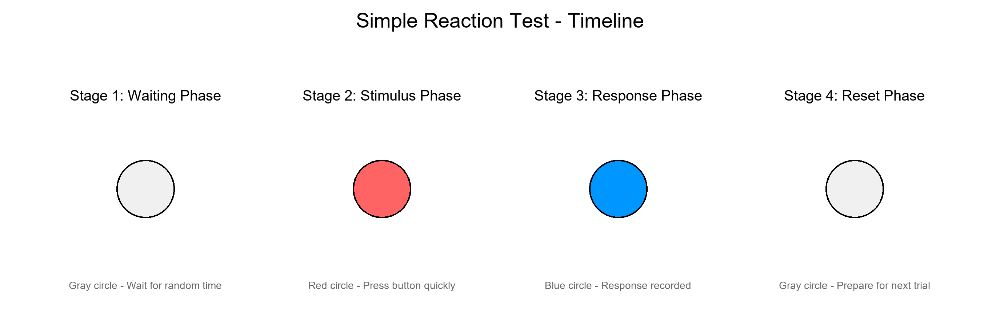
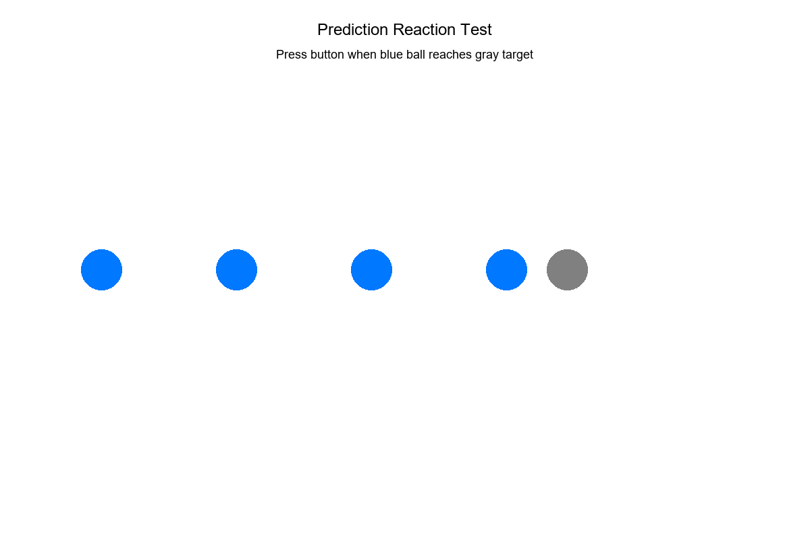
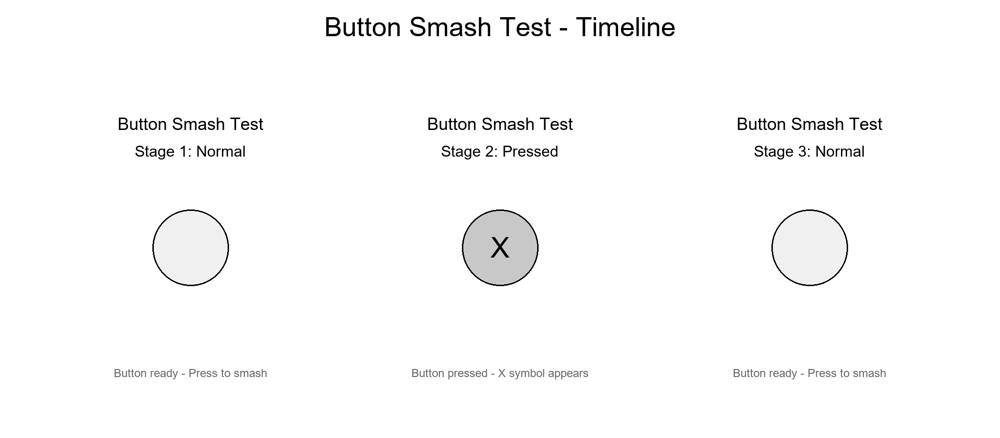
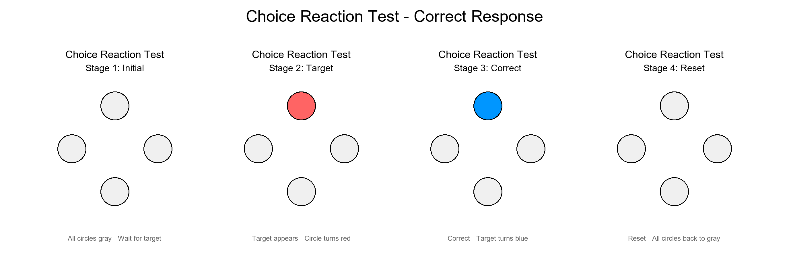
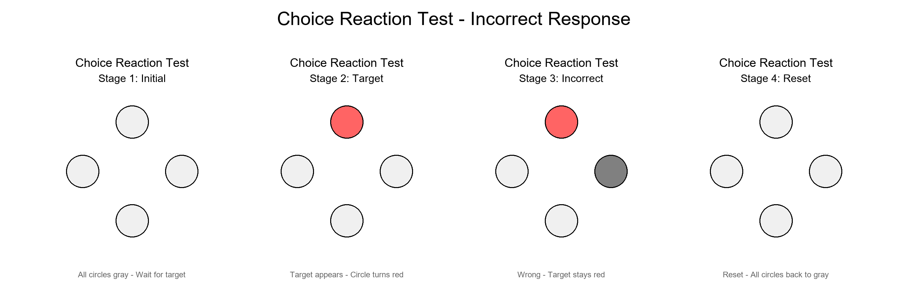
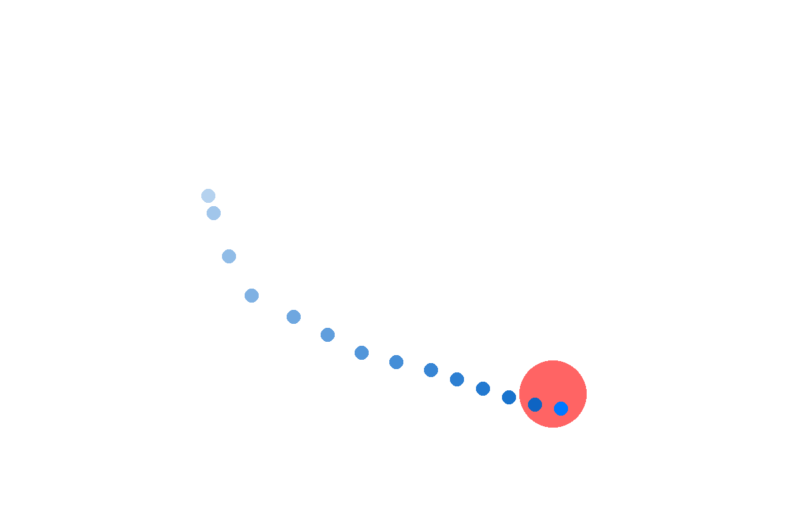
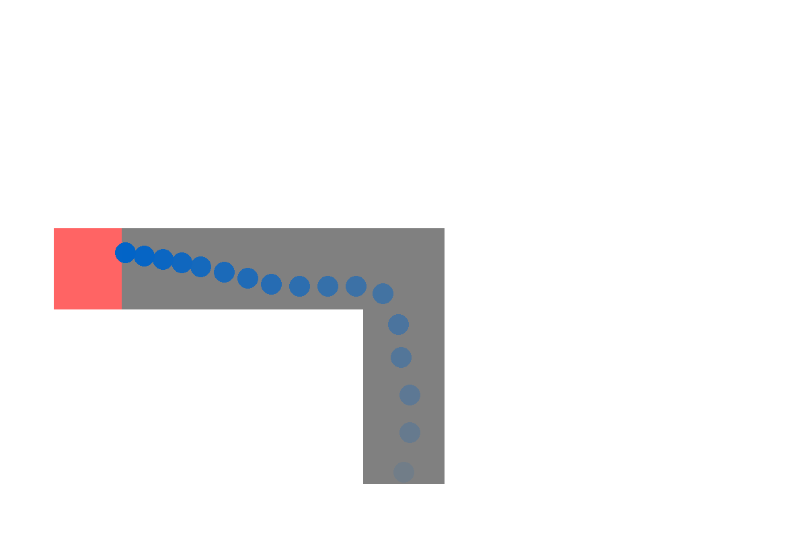

# Controller Skills Benchmark - Gamepad Testing Application

A Python and pygame-based gamepad testing application suite for measuring reaction time, precision, and coordination skills, suitable for gaming research and user experience evaluation.

## Quick Start

### System Requirements
- Python 3.8+
- macOS 10.14+ or Linux
- Supported gamepad (Joy-Con, PlayStation, Xbox, etc.)

### Installation & Usage
```bash
# Install uv (Python package manager)
curl -LsSf https://astral.sh/uv/install.sh | sh

# Clone repository
git clone https://github.com/ntu-hci-lab/PartyAssist.git
cd PartyAssist

# Run application (auto-install dependencies)
uv run python main.py

# Run in English
uv run python main.py --english

# Run in Chinese
uv run python main.py
```

## Test Categories

### Button Test Series
1. **Simple Reaction Time Test** - Basic reaction speed measurement  
   
2. **Prediction Countdown Test** - Time prediction and visual tracking ability  
   
3. **Button Smash Test** - Rapid consecutive clicking ability  
   
4. **Direction Selection Test** - Selective reaction and accuracy  
     
   

### Analog Test Series
5. **Analog Stick Movement Test** - Basic joystick control ability  
   
6. **Path Following Test** - Precise path tracking and fine motor control  
   

### Execution Methods
```bash
# Interactive menu
uv run python main.py

# Run individual tests
uv run python tests/button_reaction_time_test.py --user P1
uv run python tests/analog_move_test.py --user P1

# Gamepad connection test
uv run python common/connection_test.py
```

## Project Structure

```
controller-skills-benchmark/
├── main.py                    # Main application entry
├── tests/                     # Test modules
│   ├── button_*_test.py      # Button test series
│   └── analog_*_test.py      # Analog test series
├── common/                    # Shared modules
│   ├── controller_input.py   # Gamepad input handling
│   ├── result_saver.py       # Result storage
│   └── trace_plot.py         # Trajectory plotting
└── data/                      # Test results and charts
    ├── results/[user_id]/     # JSON results
    └── images/                # PNG trajectory plots
```

## Key Features

- **Colorblind-Friendly Design** - Blue-orange color scheme with high contrast
- **Modular Architecture** - Independent test modules, easy to extend
- **Automatic Result Storage** - JSON format with visualization charts
- **Multi-Gamepad Support** - Joy-Con, PlayStation, Xbox, etc.

## Troubleshooting

### Gamepad Connection Issues
```bash
# Gamepad connection diagnosis
uv run python common/connection_test.py

# Common solutions:
# - Ensure gamepad is connected and paired
# - Re-pair Bluetooth device
# - Check driver installation
```

### System-Related Issues
- macOS may require: `brew install sdl2`
- Linux may require: `apt install python3-tk`

## Development

```bash
# Development mode
uv shell
python main.py

# Install development dependencies
uv add --dev pytest black flake8

# Code formatting and linting
black .
flake8 .
```

## Test Results

All test results are automatically saved in standardized JSON format with accompanying visualization charts for trajectory-based tests. Results are organized by user ID and timestamp for easy analysis and comparison.
