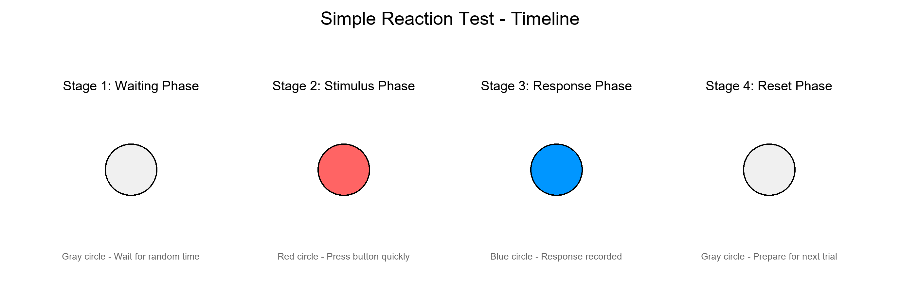
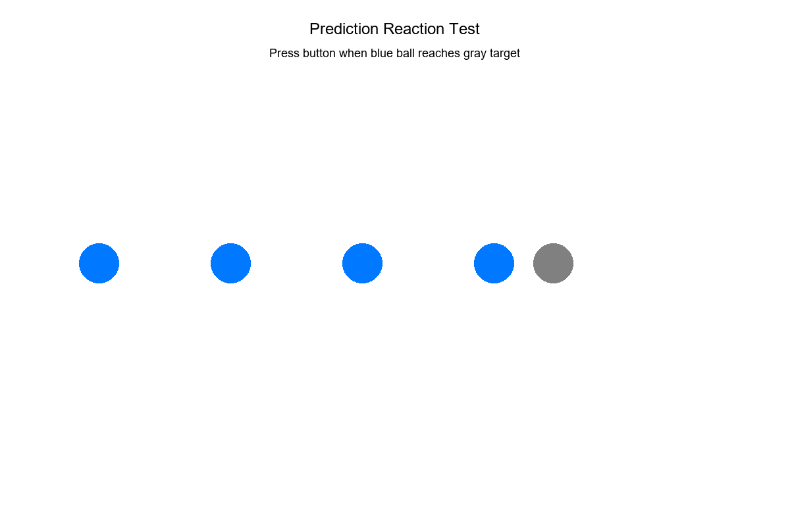
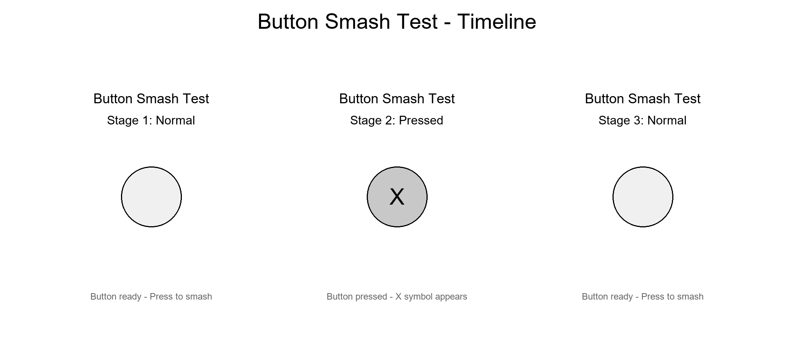
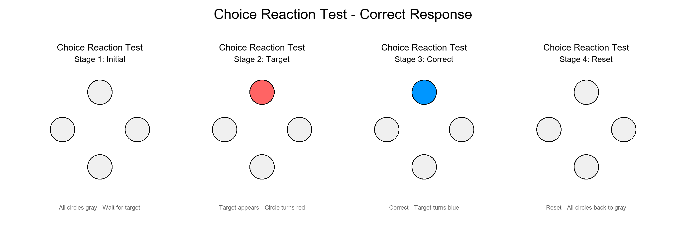
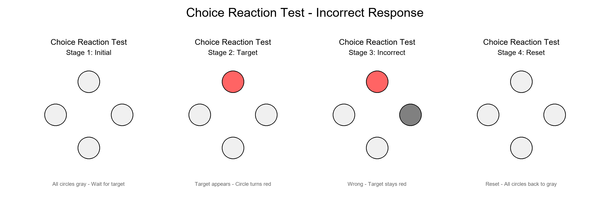
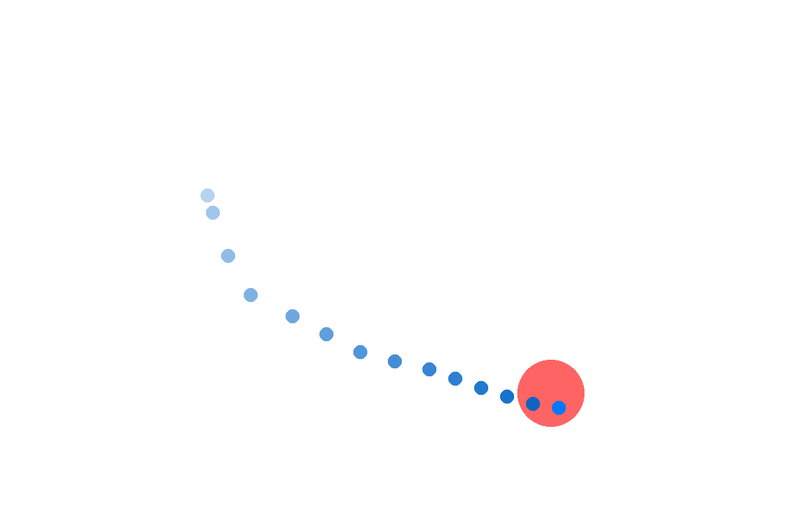
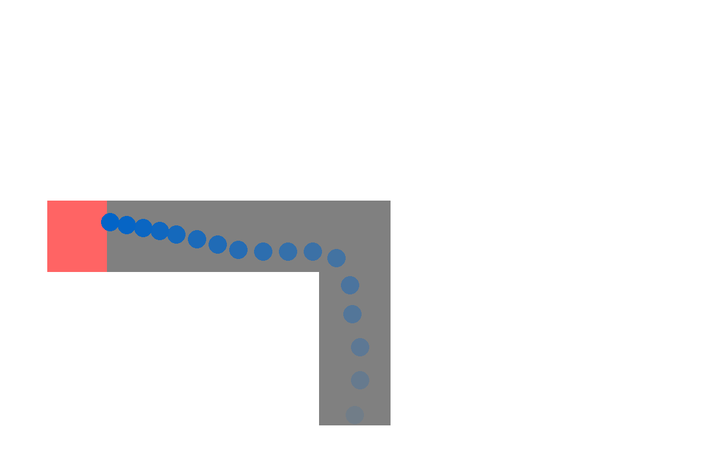

# Controller Skills Benchmark - Gamepad Testing Application

A Python and pygame-based gamepad testing application suite for measuring reaction time, precision, and coordination skills, suitable for gaming research and user experience evaluation. This repository is the experimental system and open experimental dataset used in the CHI 2026 paper below.

This repository provides two research artifacts and links to the related paper:

- **Benchmark**: the controller-skill testing system used in the paper, with six tests for measuring reaction time, prediction, rapid input, directional accuracy, analog movement, and path-following precision.
- **Open Dataset**: the de-identified experimental data collected with this system for the PartyAssist lifespan study, available in [`deidentified_test_data/`](deidentified_test_data/).
- **Paper**: [Keeping Everyone in the Game: Bringing Ability-Inclusive Family Co-Play to Unmodified Console Games](https://dl.acm.org/doi/10.1145/3772318.3791958), CHI 2026.

## Quick Start

### System Requirements
- Python 3.8+
- macOS 10.14+ or Linux
- Supported gamepad (Joy-Con, PlayStation, Xbox, etc.)

### Installation & Usage
```bash
# Install uv (Python package manager)
curl -LsSf https://astral.sh/uv/install.sh | sh

# Clone repository
git clone https://github.com/ntu-hci-lab/PartyAssist.git
cd PartyAssist

# Run application (auto-install dependencies)
uv run python main.py

# Run in English
uv run python main.py --english

# Run in Chinese
uv run python main.py
```

## Test Categories

### Button Test Series
1. **Simple Reaction Time Test** - Basic reaction speed measurement  
   
2. **Prediction Countdown Test** - Time prediction and visual tracking ability  
   
3. **Button Smash Test** - Rapid consecutive clicking ability  
   
4. **Direction Selection Test** - Selective reaction and accuracy  
     
   

### Analog Test Series
5. **Analog Stick Movement Test** - Basic joystick control ability  
   
6. **Path Following Test** - Precise path tracking and fine motor control  
   

### Execution Methods
```bash
# Interactive menu
uv run python main.py

# Run individual tests
uv run python tests/button_reaction_time_test.py --user P1
uv run python tests/analog_move_test.py --user P1

# Gamepad connection test
uv run python common/connection_test.py
```

## Project Structure

```
controller-skills-benchmark/
├── main.py                    # Main application entry
├── tests/                     # Test modules
│   ├── button_*_test.py      # Button test series
│   └── analog_*_test.py      # Analog test series
├── common/                    # Shared modules
│   ├── controller_input.py   # Gamepad input handling
│   ├── result_saver.py       # Result storage
│   └── trace_plot.py         # Trajectory plotting
└── data/                      # Test results and charts
    ├── results/[user_id]/     # JSON results
    └── images/                # PNG trajectory plots
```

## Key Features

- **Colorblind-Friendly Design** - Blue-orange color scheme with high contrast
- **Modular Architecture** - Independent test modules, easy to extend
- **Automatic Result Storage** - JSON format with visualization charts
- **Multi-Gamepad Support** - Joy-Con, PlayStation, Xbox, etc.

## Troubleshooting

### Gamepad Connection Issues
```bash
# Gamepad connection diagnosis
uv run python common/connection_test.py

# Common solutions:
# - Ensure gamepad is connected and paired
# - Re-pair Bluetooth device
# - Check driver installation
```

### System-Related Issues
- macOS may require: `brew install sdl2`
- Linux may require: `apt install python3-tk`

## Development

```bash
# Development mode
uv shell
python main.py

# Install development dependencies
uv add --dev pytest black flake8

# Code formatting and linting
black .
flake8 .
```

## Test Results

All test results are automatically saved in standardized JSON format with accompanying visualization charts for trajectory-based tests. Results are organized by user ID and timestamp for easy analysis and comparison.

## Open Dataset

The open dataset in [`deidentified_test_data/`](deidentified_test_data/) contains de-identified experimental outputs generated with this benchmark for the controller-skills study reported in the CHI 2026 paper. It includes per-participant JSON metrics and trajectory visualization images for the six benchmark tasks listed above.

For the dataset export summary, source layout, de-identification notes, and current file and participant counts, see [`deidentified_test_data/README.md`](deidentified_test_data/README.md).

Dataset layout:

```
deidentified_test_data/
├── README.md                  # Dataset export summary and de-identification notes
└── data/
    ├── results/
    │   └── participant_<id>/   # One folder per pseudonymized participant
    │       ├── button_reaction_time_<run>.json
    │       ├── button_prediction_countdown_<run>.json
    │       ├── button_smash_<run>.json
    │       ├── button_accuracy_<run>.json
    │       ├── analog_move_<run>.json
    │       └── analog_path_follow_<run>.json
    └── images/
        ├── analog_move/
        │   └── participant_<id>/run_<run>/   # Analog movement plots
        └── analog_path_trace/
            └── participant_<id>/run_<run>/   # Path-following plots
```

The current export includes:

- 80 pseudonymized participants
- 483 anonymized JSON result files
- 3,860 copied trajectory image files
- benchmark outputs for button reaction time, prediction countdown, button smash, direction selection, analog movement, and analog path following

De-identification steps include replacing participant folders with random pseudonyms, removing JSON `timestamp` fields, replacing timestamped filenames with per-test run labels, anonymizing referenced image path segments, and excluding any reverse lookup table from the published export.

The repository is released under the CC0 1.0 Universal license in [`LICENSE.txt`](LICENSE.txt). If you use the dataset or benchmark in research, please cite the paper below and include a link to this repository.

### Open Data Contributions

Contributions that refresh or extend the open dataset are welcome. If you measure new controller-skill data with this benchmark, you can submit a pull request that adds the de-identified results.

Add contributed data under the existing dataset layout:

- Put each participant's JSON files in `deidentified_test_data/data/results/participant_<id>/`.
- Use pseudonymized participant IDs such as `participant_a1b2c3d4`; do not use names, emails, institutional IDs, raw subject IDs, or other direct identifiers.
- Name result files as `<test_name>_<run>.json`, for example `button_reaction_time_001.json` or `analog_path_follow_002.json`.
- Put analog movement images in `deidentified_test_data/data/images/analog_move/participant_<id>/run_<run>/`.
- Put path-following images in `deidentified_test_data/data/images/analog_path_trace/participant_<id>/run_<run>/`.
- Keep any image references inside JSON files aligned with the de-identified paths.

Before opening a PR:

1. Collect raw benchmark results with `main.py` or the individual test scripts.
2. Run `create_deidentified_test_data.py` to generate a de-identified export.
3. Review the generated bundle before publishing to confirm that no direct identifiers, raw timestamps, or reverse lookup tables are included.
4. Add only de-identified files under `deidentified_test_data/`; do not commit raw `data/` output.
5. Update [`deidentified_test_data/README.md`](deidentified_test_data/README.md) if participant counts, file counts, task coverage, or de-identification notes change.
6. Open a pull request and describe the data source, benchmark version, task coverage, participant pseudonymization method, and any schema changes.

## Paper

This benchmark and dataset accompany the CHI 2026 paper:

**Keeping Everyone in the Game: Bringing Ability-Inclusive Family Co-Play to Unmodified Console Games**

Chieh-Yu Wen, Sky Shih-Kai Hong, Jia-Jia Liao, Ruei Ci Lai, Zi-Yun Lai, Shu-Chen Liu, Hsien-Hui Tang, and Mike Y. Chen.
[https://dl.acm.org/doi/10.1145/3772318.3791958](https://dl.acm.org/doi/10.1145/3772318.3791958)

BibTeX:

```bibtex
@inproceedings{wen2026keeping,
  title = {Keeping Everyone in the Game: Bringing Ability-Inclusive Family Co-Play to Unmodified Console Games},
  author = {Wen, Chieh-Yu and Hong, Sky Shih-Kai and Liao, Jia-Jia and Lai, Ruei Ci and Lai, Zi-Yun and Liu, Shu-Chen and Tang, Hsien-Hui and Chen, Mike Y.},
  booktitle = {Proceedings of the 2026 CHI Conference on Human Factors in Computing Systems},
  year = {2026},
  pages = {1--21},
  publisher = {Association for Computing Machinery},
  doi = {10.1145/3772318.3791958}
}
```

## Generate De-identified Test Data

`create_deidentified_test_data.py` is designed to work with the raw JSON and image outputs produced by `main.py` and the individual test scripts. It accepts any of the following as `--source-root`:

- the repository root, when results are stored under `data/results` and `data/images`
- the `data/` directory itself
- a legacy exported root that still contains `data/results` and `data/images`

Example workflow:

```bash
# 1. Run tests and collect raw data
uv run python main.py

# 2. Generate the de-identified bundle from the current repo data/
uv run python create_deidentified_test_data.py

# 3. Or point to a different source/output location explicitly
uv run python create_deidentified_test_data.py --source-root data --output-root /tmp/deidentified_test_data
```

The generated files will be written to `deidentified_test_data/` by default. Before sharing, review the output bundle to make sure it matches the data you intend to publish.

If you regenerate `deidentified_test_data/` from new `main.py` output, you can commit the refreshed de-identified dataset and open a PR back to this repository with the updated files.
